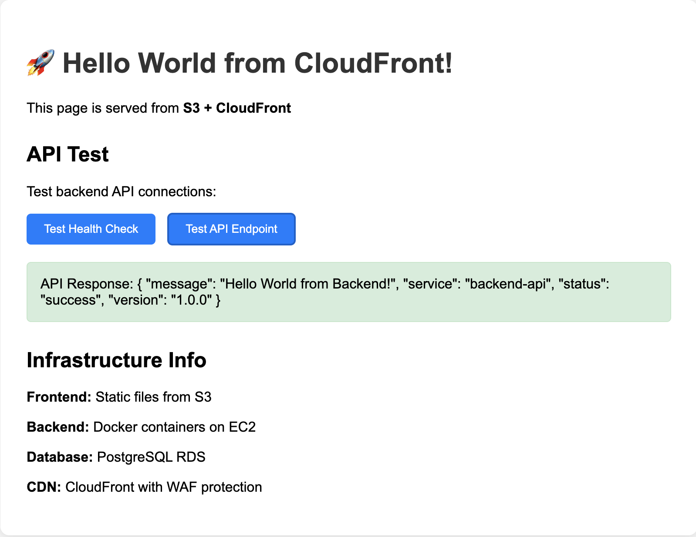

# AWS Terraform Infrastructure Project

## Завдання
Підготувати Terraform код для розгортання простого застосунку: фронт, бекенд, база даних. Рекомендовані сервіси: VPC, EC2, CloudFront. Також підготувати конфігурацію Nginx та Docker Compose для інфраструктури на EC2.

## Реалізація
Повна AWS інфраструктура з веб-додатком, базою даних та CloudFront CDN, розгорнута за допомогою Terraform із використанням Docker Compose та Nginx.

### Виконання завдання:
✅ **Фронт**: Статичні файли HTML/CSS/JS розміщені в S3 та роздаються через CloudFront CDN  
✅ **Бекенд**: Flask API у Docker контейнерах на EC2 з автоматичним масштабуванням  
✅ **База даних**: PostgreSQL RDS у приватних сабнетах з автоматичним бекапом  
✅ **VPC**: Повноцінна мережева архітектура з публічними та приватними сабнетами  
✅ **EC2**: Auto Scaling Group з Launch Template для бекенду  
✅ **CloudFront**: CDN з WAF захистом для фронту та проксування API  
✅ **Nginx**: Реверс-проксі для маршрутизації між фронтом і бекендом  
✅ **Docker Compose**: Контейнеризація бекенду з автоматичним деплоєм

### Ключові файли конфігурацій:
- **`configs/docker-compose.yml`** - Docker Compose для бекенду та Nginx
- **`configs/nginx.conf`** - Nginx конфігурація з проксуванням API
- **`applications/backend/`** - Flask API застосунок
- **`applications/frontend/public/index.html`** - Frontend інтерфейс
- **`shared/modules/`** - Terraform модулі для всіх компонентів

## Структура проекту

```
terraform-test/
├── environments/
│   ├── dev/                    # Development environment
│   │   ├── main.tf
│   │   ├── terraform.tfvars    # Налаштування для dev
│   │   └── outputs.tf
│   └── prod/                   # Production environment
│       ├── main.tf
│       ├── terraform.tfvars
│       └── outputs.tf
├── shared/
│   └── modules/
│       ├── vpc/                # VPC and networking
│       ├── security/           # Security groups and IAM
│       ├── database/           # RDS PostgreSQL
│       ├── compute/            # EC2, ALB, Auto Scaling
│       ├── s3-apps/            # S3 buckets for applications
│       └── cloudfront/         # CloudFront CDN
├── applications/
│   └── backend/                # Flask backend application
└── configs/
    ├── docker-compose.yml      # Docker configuration
    └── nginx.conf              # Nginx configuration
```

## Архітектура інфраструктури

### Компоненти системи:
- **Frontend**: Статичні файли в S3 + CloudFront CDN
- **Backend**: Flask API в Docker контейнерах на EC2
- **Database**: PostgreSQL RDS в приватних сабнетах
- **Load Balancer**: Application Load Balancer
- **Security**: WAF, Security Groups, IAM ролі
- **Monitoring**: CloudWatch логи та метрики

### Мережева архітектура:
- **VPC**: Ізольована мережа в AWS
- **Public Subnets**: ALB, NAT Gateway
- **Private Subnets**: EC2 instances, RDS
- **Multi-AZ**: Розподіл по зонам доступності

## Ініціалізація проекту

### 1. Підготовка backend налаштувань

Створіть файл `backend-config.hcl`:
```hcl
bucket = "your-terraform-state-bucket"
key    = "dev/terraform.tfstate"
region = "eu-central-1"
encrypt = true
use_lockfile = true
```

### 2. Налаштування змінних

Відредагуйте `environments/dev/terraform.tfvars`:
```hcl
# Основні налаштування
project_name = "my-project"
environment  = "dev"
aws_region   = "eu-central-1"

# Мережа
vpc_cidr           = "10.0.0.0/16"
availability_zones = ["eu-central-1a", "eu-central-1b"]
public_subnets     = ["10.0.1.0/24", "10.0.2.0/24"]
private_subnets    = ["10.0.11.0/24", "10.0.12.0/24"]

# Безпека
admin_cidr = "YOUR_PUBLIC_IP/32"  # ЗАМІНІТЬ на вашу IP адресу

# База даних
db_instance_class           = "db.t3.micro"
db_allocated_storage        = 20
db_max_allocated_storage    = 50
db_engine_version           = "17.4"
enable_enhanced_monitoring  = false
enable_performance_insights = false

# Обчислювальні ресурси
instance_type    = "t3.micro"
min_size         = 1
max_size         = 2
desired_capacity = 1

# Теги
default_tags = {
  Project     = "my-project"
  Environment = "dev"
  ManagedBy   = "terraform"
  CostCenter  = "development"
}
```

### 3. Розгортання інфраструктури

```bash
# Перейдіть в директорію середовища
cd environments/dev

# Ініціалізація Terraform
terraform init -backend-config=../../backend-config.hcl

```

## Тестування системи

### 1. Отримання URL для перевірки

```bash
# Отримайте CloudFront URL
terraform output cloudfront_url
```

### 2. Перевірка компонентів

Після успішного розгортання, використовуйте наступні URL для тестування:

### Результат роботи системи



*Веб-інтерфейс показує успішну роботу всіх компонентів: Frontend (S3+CloudFront), Backend (EC2+Docker), Database (RDS PostgreSQL), CDN (CloudFront+WAF)*

#### Frontend (CloudFront):
```bash
# Головна сторінка
curl https://your-cloudfront-url.cloudfront.net/

# Або відкрийте в браузері
https://your-cloudfront-url.cloudfront.net/
```

#### Backend API через CloudFront:
```bash
# Health check
curl https://your-cloudfront-url.cloudfront.net/health

# API endpoint
curl https://your-cloudfront-url.cloudfront.net/api/hello

```

#### Тестування через ALB (напряму):
```bash
# Отримайте ALB URL
terraform output alb_dns_name

# Тестування
curl http://your-alb-url.eu-central-1.elb.amazonaws.com/health
curl http://your-alb-url.eu-central-1.elb.amazonaws.com/api/hello
```

### 3. Перевірка на сервері

Якщо підключились до EC2 через SSH:
```bash
# Локальне тестування
curl http://localhost/health
curl http://localhost/api/hello

```

## Безпека

- **RDS**: Розміщена в приватних сабнетах
- **Security Groups**: Мінімальні необхідні права доступу
- **IAM**: Ролі з обмеженими правами
- **WAF**: Захист від web-атак
- **Encryption**: Шифрування в спокої та при передачі

## Підтримка

- Backup бази даних налаштовано автоматично
- State файли зберігаються в S3 з шифруванням

## Очищення ресурсів
 
**Увага**: Перед видаленням переконайтесь, що ви зберегли всі важливі дані з бази даних.

```bash
# Видалення всієї інфраструктури
terraform destroy -var-file=terraform.tfvars
```

